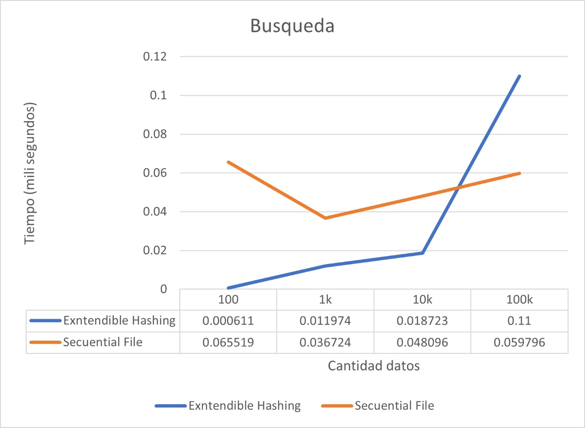

# Proyecto 1 de Base de Datos 2

## Integrantes de Proyecto:

* Cristhoper Michel Heredia Lapa
* Luis Eduardo Ponce Contreras

## Introducción

El objetivo de este proyecto es realizar un gestor de base de datos utilizando operaciones de búsqueda, búsqueda por rango, inserción y eliminación, usando dos técnicas de organización de archivos: 

* Sequential File
* Extendible Hashing.

El dominio de datos esta basado en los estudiantes Universitarios. Los campos son: 

* Código
* Nombre
* Apellidos
* Carrera

## DETALLE DE LAS TECNICAS DE ORGANIZACION DE ARCHIVOS UTILIZADAS

### Sequential File

#### Busqueda 

```
vector<Alumno> search(string key);
```

Detalle:

* La funcion de busqueda se apoya de una busqueda binaria lo cual devuelve un entero positivo o negativo, El cual indica la posición del objeto con dicha key a encontrar. 
  
* Busqueda exitosa en DATA FILE:
    
    * Si devuelve un entero positivo es porque el objeto se encuentra en el DATA FILE y la busqueda a sido exitosa, la busqueda nos devuelve un vector y este contiene los elementos desde la posición anterior en DATA FILE del objeto encontrado hasta el ultimo elemento que apunte al objeto buscado. 


* En caso nos devuelve un numero negativo:

    * Significa que el elemento no se encuentra en DATA FILE y obtendra la posicion en negativo de un elemento menor al de nuestra key , luego leera si este apunta a AUXILIAR FILE si es asi empezara una busqueda lineal siguiendo los nextval hasta llegar al objeto encontrado.


* La busqueda realiza una cantidad de accesos a memoria secundaria de O(log(n) + k) siendo n la cantidad de elementos en DATA FILE y siendo k la cantidad de elementos en AUXILIAR FILE que hay entre el objeto anterior al elemento buscado en DATA FILE y el elemento buscado.


#### Busqueda por Rango

```
vector<Alumno> rangeSearch(string begin-key, string end-key) 

```

* La funcion de Busqueda por Rango utiliza la Funcion de busqueda binaria anterior para localizar el begin-key o elmentos mayores a el y menores a end-key y una vez encontrado es recorrer linealmente los punteros hasta encontrar un elemento mayor o igual end-key.

* La busqueda por rango realiza una cantidad de accesos a memoria secundaria de O(log(n) + k) siendo n la cantidad de elementos en el DATA FILE y siendo k la cantidad la cantidad de elementos entre el begin-key y el end-key.


#### Inserción

```
void add(Alumno registro)
```

* La funcion de insercion utiliza la busqueda binaria para obtener la posicion de donde insertar y luego hace un intercambio de los punteros. 

* Casos:

    * En el mejor de los casos se inserta en la ultima posicion en el cual el costo de solo la insercion sin contar la busqueda seria de O(1).
    
    * Al momento de insertar en elementos borrados se localiza con la busqueda binaria el elemento que apunte a -2 y el elemento anterior, si este se encuentra en auxiliar se realiza una busqueda lineal extra hasta econtrar el elemento que apunta al elemento borrado, para luego insertar encima.
    
* La Insercion realiza una cantidad de accesos a memoria secundaria de O(log(n)+k) por la busqueda de un elemento menor al que se va a insertar y O(2) al sobrescribir los punteros que se intercambian para la insercion.   

#### Eliminación

```
void remove(string key)
```

* Esta utiliza las condiciones de la busqueda indiviual para el vector de objetos con las posiciones de los objetos que deben intercambiar sus valores 

* Casos:

    * Si el DATA FILE y el AUXILIAR FILE no tienen datos, entonces no hay nada que eliminar.

    * Verificamos que la key existe y utilizamos la funcion de busqueda implementada para obtener un vector de registros del cual usaremos el elemento anterior y el elemento anterior al anterior.

    * Si este no cuenta con un elemento anterior al anterior de la key implementamos la busqueda de nuevo pero para el objeto anterior al que queremos eliminar para asi obtener su posicion.

        * Si el objeto sigue sin devolver mas elementos en el vector de objetos devuelto por la busqueda significa que la posicion del elemento anterior se encuentra en el header, por lo cual tenemos que leer el header y almacenar la posicion de este o seguir la cadena de punteros hasta llegar al que apunta al ultimo elemento.

    * Si tenemos el elemento anterior a el elemento al que queremos eliminiar usamos su siguiente valor para identificar la posicion del elemento queremos sobrescribir con los punteros de el elemento que queremos eliminar.  


### Extendable Hash

#### Busqueda 


Alumno search(string key);


Detalle:

* La funcion de busqueda meidante el hash hacia el nodo donde se deberia encontrar el Alumno. 

* Se recupera el bucket donde se puede encontrar el alumno, esta busqueda en costo O(1).

* Realizamos una busqueda lineal en el bucket para tratar de encontrar al alumno, en caso no se encuentre pero el bucket apunte hacia otro bucket, entonces recuperaremos ese bucket.

* SI luego de toda la busqueda el Alumno no es encontrado entonces el valor no se encuentra.

* El costo final es O(1) en el mejor de los casos o N * O(1), donde N es el numero de Buckets que se pueden recuperar y estan elazados, para tratar de encontrar el Alumno


#### Inserción


void add(Alumno registro)

* La funcion de insercion utiliza el hashing para encontrar el nodo en costo de O(1) para encontra el alumno, luego se proce insertar,

* Casos:

    * Si el Extendable Hash se encuentra vacion se insertan los dos nodos y luego se inserta el blucket con el respectivo Alumno y luego hacemos que el nodo apunte al Bucket.

    * Si el Bucket no se enucentra lleno se inserta el Alumno en el bucket correspondiente.

    * Si el Bucket se encuentra lleno pero la profundidad del nodo es menor a la profundidad de la estructura, entonces se crea un nuevo bucket, se reorganiza los Alumnos dentro de los buckets, finalmente un nodo apuntara al antiguo bucket y el otro nodo apuntara al bucket recien creado. Adicionalmente se aumentara la profundiadad de cada uno de los nodos. 

    * Si el Bucket se encuentra lleno pero la profuncidad del nodo es igual a la prifundidad del bucket y ademas la profundiada del hash es diferente a la profundiadad maxima a la que puede llegar se aumentara la cantidad de nodos (2^(pronfindad del nodo +1)). Luego se recomputa los buckets al que apunta cada nodo.

    * Si  el Bucket se encuentra lleno, la profundiada del nodo es igual a la profundidad del hash y a la vez es igual a la profundidad maxima, se procedera a crear un nuevo bucket, y se anidara al bucket que se encuentra lleno, para posteriormente insertarlo cuando se encuentre en un bucket con espacio.

* En el mejor de los casos la insercion sera O(1), sin embargo en caso se tenga que buscar en la lista de buckets sera N * O(1), donde N es el numero de buckets anidados que se debe recuperar en disco para lograr la insercion adecuada.


#### Eliminación


void remove(string key)

* En el proceso de eliminacion se realiza una busqueda del nodo en donde se encontrar el bucket a eliminar

* Si el bucket aputnado por el nodo contiene al valor lo eliminara de manera simple

* Si dos buckets que previamente estaban juntos, luego de eliminar un valor, y su cantidad de Alumnos es menor al MAX SIZE DEL BUCKET, entonces estos se juntaran.

* El costo de liminacion es O(1) en el mejor de los casos, pero si se debe hcer una bisqueda lineal en los buckets encadenados, el costo seria N * O(1) busquedas en disco, donde N es el numero de buckets encadenados hasta encontrar al bucket que tiene el elemento.


# Comparacion de Tiempos




